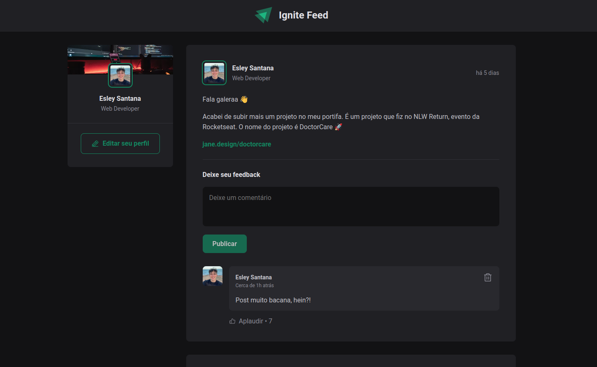

# Ignite Feed React

Este projeto foi desenvolvido durante o curso **Ignite** da Rocketseat, com o objetivo de criar uma aplicação de feed de postagens. A aplicação foi construída com **React** e **JavaScript**, utilizando o conceito de componentes reutilizáveis e gerenciamento de estado com hooks.

## 🚀 Tecnologias Usadas

- **React**: Biblioteca JavaScript para construção de interfaces de usuário.
- **Vite**: Ferramenta de build e desenvolvimento rápido.
- **CSS Modules**: Para gerenciamento de estilos locais no projeto.

## ⚙️ Funcionalidades

- **Exibir lista de postagens**: A aplicação lista postagens simuladas.
- **Adicionar novo comentário**: Usuários podem adicionar comentários nas postagens.
- **Excluir um comentário**: Usuários excluir seus comentários.
- **Aplaudir comentários**: Usuários podem aplaudir comentários.

## 🎯 Objetivos

- **Praticar o uso de estados no React**.
- **Entender a imutabilidade do estado**.
- **Trabalhar com listas dinâmicas e a manipulação de chaves em React**.
- **Aplicar conceitos de componentização e reutilização de componentes**.

## 🖼 Layout do Projeto

